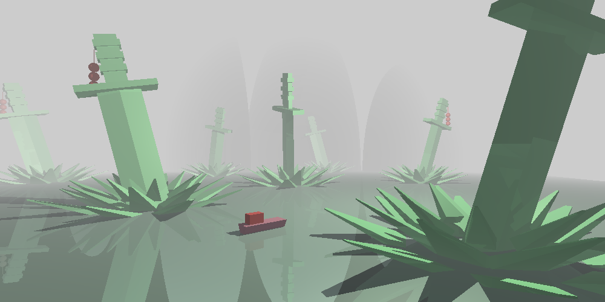

Raytracer
--------

This is a raytracer I wrote in my computer graphics course. Features include:

* Phong lighting
* Hard shadows
* Hierarchical model structure
* Mirror reflections
* Linear fog

Supported Geometries are:

* Spheres
* Cubes
* Polygonal meshes

Samples (more can be found in `data` folder):

